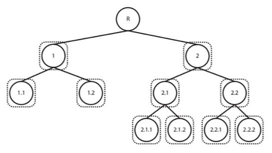

# Simplified version of a hierarchical classifier

Creator: khanh.brandy

Created on 2021-02-04

**DESCRIPTION**

  

- <b>Intuition</b>: use hierarchical classification approach to deal with a multi-class classification problem. In particular, the classes are hierarchically organizing, creating a tree or DAG (Directed Acyclic Graph) of categories, exploiting the information on relationships among them (we know that there are some shared characteristics among these classes, and that we can group them together based on those characteristics and exploit their relationships). 

- Each node is a binary classifier (one-vs-all classification)

